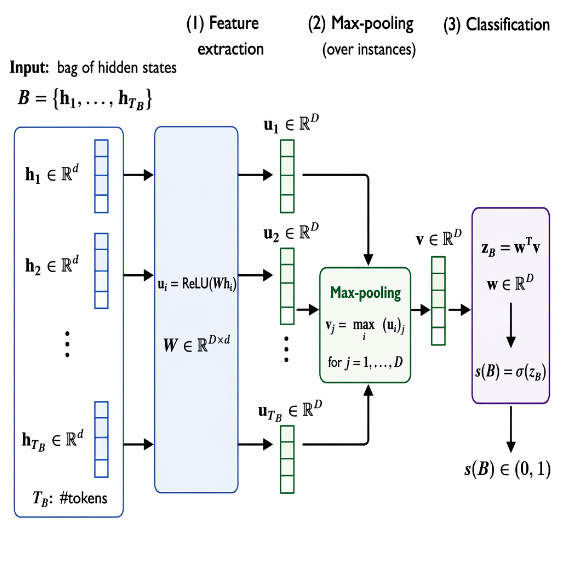

# Hallucination Detection Pipeline



This repository contains research code for training a hallucination detection model using answers generated by large language models and their correctness judgments.
The `gen/` directory handles answer generation and evaluation, and the `Detection/` directory trains the final classifier.

## 1. Setup

1. Prepare a Python 3.10+ environment and install dependencies.
   ```bash
   pip install -r requirements.txt
   ```
   Main libraries: `torch`, `transformers`, `datasets`, `openai`, `tenacity`, `python-dotenv`, `numpy`, `tqdm`, `scikit-learn`
2. Copy `.env.example` to `.env` and set tokens/endpoints.
   ```bash
   cp .env.example .env
   ```
   - `OPENAI_API_KEY` / `AZURE_OPENAI_API_KEY`: API key for the LLM used in evaluation
   - `AZURE_OPENAI_ENDPOINT`: Endpoint when using Azure OpenAI
   - `HUGGINGFACE_HUB_TOKEN`: Set only if required for downloading Hugging Face models
   - `HF_HOME`: Defaults to `~/.cache/huggingface` if omitted
   - For BioASQ, set `BIOASQ_TRAIN_PATH` to your local JSON path
3. Ensure the Hugging Face cache directory (`HF_HOME`) and the `Data/` directory are writable.

## 2. Data Layout

```
Hallucination_Detection/
├── Data/
│   └── <MODEL_NAME>/<DATA_NAME>/  # Artifacts generated by job1-3
├── Detection/                     # Hallucination detection model
└── gen/                           # Generation and evaluation scripts
```

- `job1` outputs `.pkl` and `.jsonl` files under `Data/<MODEL_NAME>/<DATA_NAME>/`.
- Subsequent jobs read from the same directory.

## 3. Pipeline Execution (job1 -> job4)

Each job script is written for an HPC job scheduler (assuming PJM).
Please adapt `#PJM` lines and `module load` settings to your environment.

1. **job1: Generation (`gen/job1.sh`)**
   - Runs `gen/generation/generate_answers.py` and generates `r=5` answers per sample for the selected model and dataset.
   - Saves per-layer hidden-state pickle files (`*_layer*.pkl`) and QA JSONL (`qa_*.jsonl`).
   - Example:
   ```bash
   MODEL_NAME=llama3_70b DATA_NAME=nq \
   bash gen/job1.sh
   ```

2. **job2: Correctness Scoring (`gen/job2.sh`)**
   - `gen/generation/eval_correctness.py` uses an LLM (e.g., Azure OpenAI) to judge correctness of each generated answer and writes to `acc_*.jsonl`.
   - Example:
   ```bash
   MODEL_NAME=llama3_70b DATA_NAME=nq EVAL_MODEL=gpt-5-mini \
   bash gen/job2.sh
   ```

3. **job3: Entailment Clustering (`gen/job3.sh`)**
   - `gen/generation/compute_entailment.py` evaluates entailment relations among generated answers and stores cluster/entropy metrics in `se_*.jsonl`.
   - On first use, it creates API cache files (`entailment_cache_*.pkl`).
   - Example:
   ```bash
   MODEL_NAME=llama3_70b DATA_NAME=nq \
   bash gen/job3.sh
   ```

4. **job4: Detector Training (`Detection/job4.sh`)**
   - Runs `Detection/main.py` to train the hallucination detector using the computed metrics as features.
   - Saves results under `results/`.
   - Example:
   ```bash
   MODEL_NAME=llama3_8b DATA_NAME=trivia_qa SAVE_DIR=./results \
   bash Detection/job4.sh
   ```

You can also run them manually from the repository root:

```bash
bash gen/job1.sh
bash gen/job2.sh
bash gen/job3.sh
bash Detection/job4.sh
```

## 4. Customization

- **Switch model/data**: Override `MODEL_NAME`, `DATA_NAME`, `DATA_DIR`, `SAVE_DIR`, etc. with environment variables.
  Example: `MODEL_NAME=mistral_12b bash gen/job1.sh`
- **API settings**: Even without Azure OpenAI, the scripts can work with compatible endpoints via `OPENAI_API_KEY`. If required variables are missing, scripts stop with explicit errors.
- **Cache paths**: Override `HF_HOME`, `TRANSFORMERS_CACHE`, `HF_DATASETS_CACHE`, `TRITON_CACHE_DIR` in `.env` when needed.

## 5. Troubleshooting

- **API key errors**: Confirm `AZURE_OPENAI_API_KEY` and `AZURE_OPENAI_ENDPOINT` are set in `.env`.
- **Missing data**: Confirm `Data/<MODEL_NAME>/<DATA_NAME>/` exists and `job1` completed successfully.
- **BioASQ load failure**: Confirm `BIOASQ_TRAIN_PATH` points to a valid JSON file.

For public repositories, use this README and `.env.example`, and keep environment-specific settings in `.env` and at the top of job scripts.
